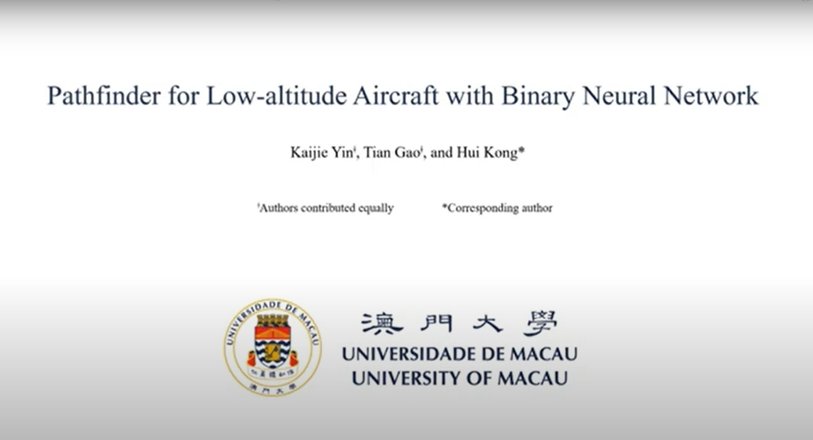

# Pathfinder

This code is an implementation of our work "[Pathfinder for Low-altitude Aircraft with Binary Neural Network](https://arxiv.org/pdf/2409.08824)", published in IROS 2025.

## Citation

If you find our code useful for your research, please consider citing:

    @inproceedings{yin2020pathfinder,
      title={Pathfinder for Low-altitude Aircraft with Binary Neural Network},
      author={Yin, Kaijie and Gao, Tian and Kong, Hui},
      booktitle={IEEE/RSJ International Conference on Intelligent Robots and Systems (IROS)},
      year={2025}
    }

## Prepare

### 1. Requirements:

- PyTorch (version 2.5.1)
- numpy
- timm
- transformers (version 4.39.2)

### 2. Data:

- We currently provide the RS-LVF dataset: [GoogleDrive](https://drive.google.com/drive/folders/1m90p0mHoYcW7O2E8f-7LoeX5GuJCEmuw?usp=sharing)

## Models

- RS-LVF: [GoogleDrive](https://drive.google.com/drive/folders/1DyRSfZthKfNTzZmp4pAsqmNMlNsrkayV?usp=sharing)
- SensatUrban: [GoogleDrive](https://drive.google.com/drive/folders/1-JYUPwwEtgK1ko33qrevM13q0IB67zxk?usp=sharing)

## Acknowledgements

Our code refers to [PMF](https://github.com/ICEORY/PMF) and [BHViT](https://github.com/IMRL/BHViT/tree/main).

Our dataset refers to [MARS-LVIG Dataset](https://mars.hku.hk/dataset.html).

##  Contact

Any problem, please contact the first author (Email: yin.kaijie at connect.um.edu.mo)

